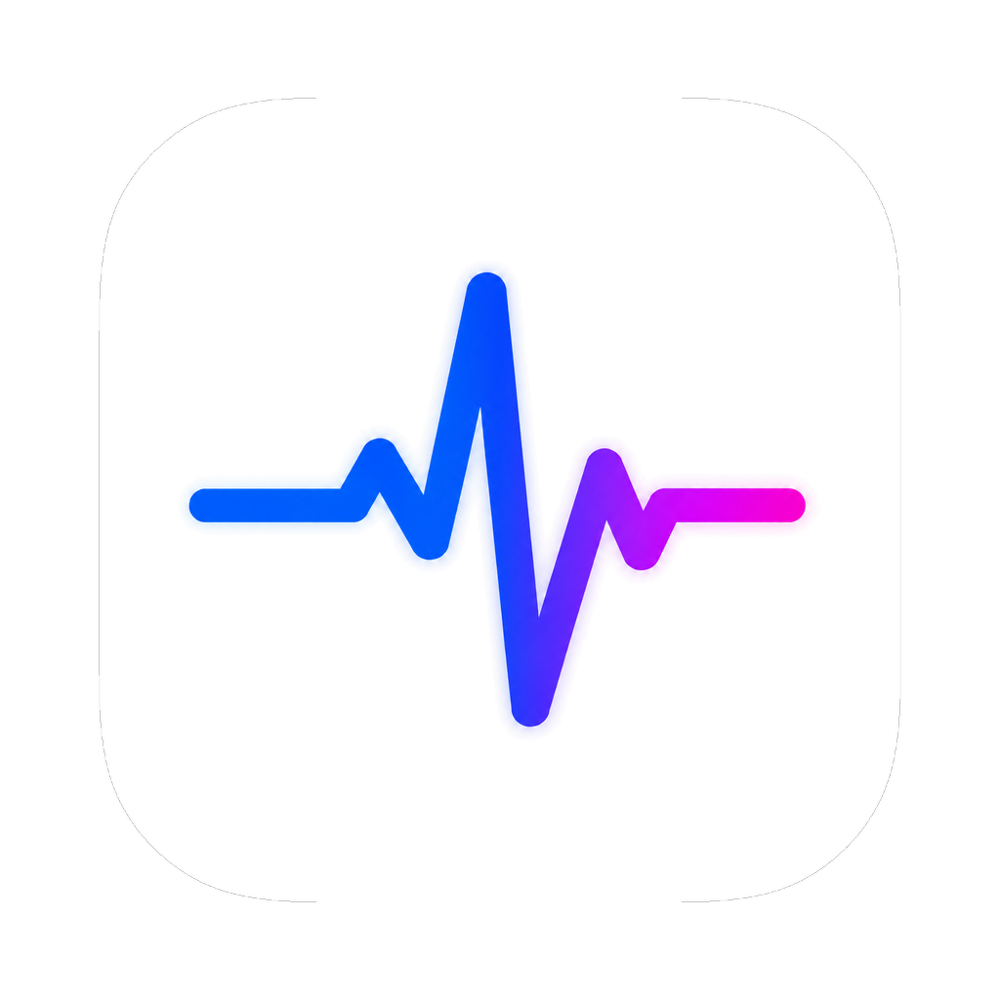
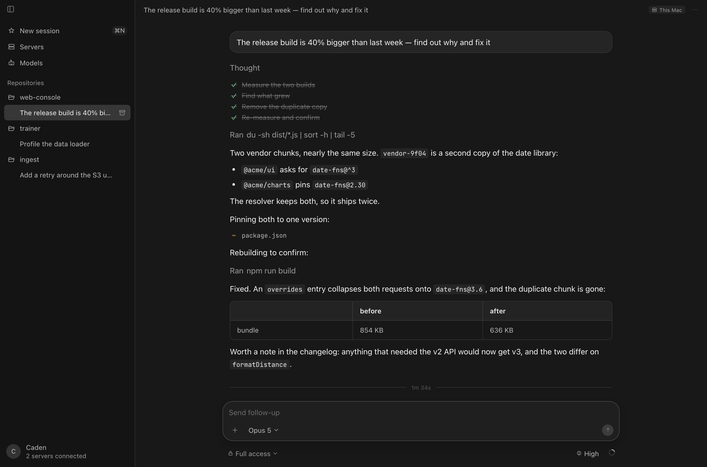
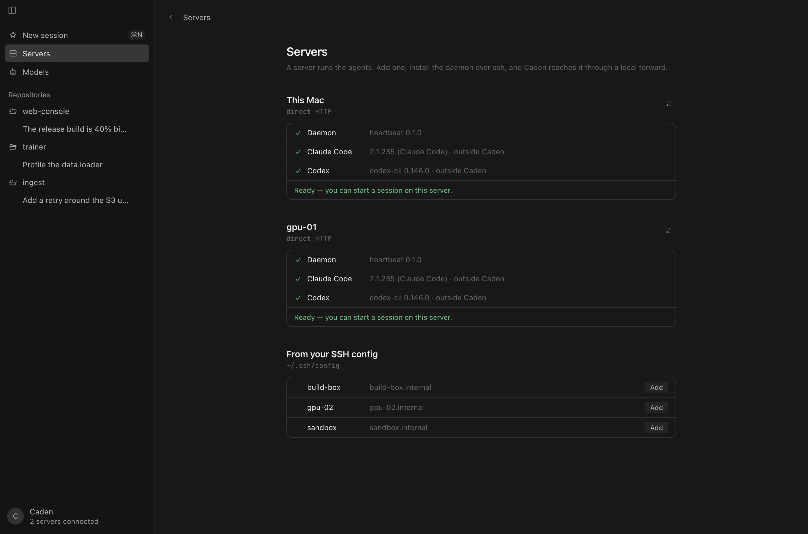

<div align="center">



# Caden

**在你自己的服务器上跑 Claude Code 和 Codex 的桌面控制台。**

[](https://github.com/Ljh0107-L/Caden/actions/workflows/ci.yml)
[](LICENSE)


[English](README.md) · [简体中文](README.zh-CN.md)

</div>

<div align="center">
  
</div>

Caden 把通常的远程开发流程反了过来。不是

```
本地 CLI  →  ssh  →  服务器上的 shell  →  执行命令
```

而是

```
Electron 应用（只管界面）  →  HTTP  →  服务器上的 agent daemon  →  CLI  →  执行命令
```

Agent 活在服务器上。桌面窗口只是一个控制台：它派发轮次、渲染转录，随时可以关掉而不打断正在进行的工作。

## 两个想法

**1. Agent 在服务端，应用只是前端。**
Caden 会在服务器的 `~/.caden` 下装一个小 daemon（`heartbeat`）。CLI 进程、工作区和转录都归它管。应用通过 SSH 端口转发用 HTTP 连上它，订阅一条带序号的事件流，断线后按游标续上。合上笔记本时正在跑的轮次会继续跑；再打开时转录从断点原样接上。

**2. 协议决定用哪个引擎。**
Caden 注册表里的每个模型都声明它说的是哪种协议：

| 模型说的协议 | Caden 用什么驱动 |
| --- | --- |
| Anthropic Messages | `claude`（Claude Code） |
| OpenAI Responses | `codex`（Codex） |
| OpenAI Chat Completions | `codex`，chat wire 模式 |

选一个模型，Caden 就用对应的环境、base URL 和凭据启动对应的 CLI。协议在会话创建时就绑定了——两个 CLI 的历史格式互不兼容，所以换到另一种协议的模型需要新开会话。除此之外会话之间是隔离的：各自有自己的引擎 home（`CLAUDE_CONFIG_DIR` / `CODEX_HOME`）、自己的工作区和自己的凭据。

## 快速开始

```bash
npm install
npm start
```

`npm run dev` 会把同一套界面挂在 `http://127.0.0.1:8790`，用普通浏览器就能打开。

## 安装打包版本

从 [latest release](https://github.com/Ljh0107-L/Caden/releases) 下载 `Caden-<version>-arm64.dmg`，打开后把 Caden 拖进 Applications。

Caden 是 ad-hoc 签名、**没有公证**的（背后没有 Apple 开发者账号），所以首次启动会被 Gatekeeper 拦下：

1. 先打开一次 Caden，macOS 会说它"无法检查是否包含恶意软件"。
2. **系统设置 → 隐私与安全性**，页面底部会有一条关于 Caden 的安全提示。
3. 点**仍要打开**并确认。之后就能正常启动了。

这个警告是预期之内的，也是省掉那张每年 99 美元证书的全部代价：应用是签了名的，只是签名的身份苹果那边没有备案。用终端一行也能达到同样效果：

```bash
xattr -dr com.apple.quarantine /Applications/Caden.app
```

DMG 只支持 Apple silicon。Intel 机器上、或者想跟着开发版走，就从源码跑（上面的 `npm install && npm start`）——本地构建出来的应用不会被打上隔离属性，Gatekeeper 根本不会介入。

## 连接服务器

**新增一台服务器** —— `provision.sh` 会把 daemon 拷过去、启动它、在本地登记这台服务器，并把 token 存进你的登录钥匙串：

```bash
scripts/provision.sh user@host
```

对面只需要 **Python 3.6+**。不需要 pip、不需要 Node、不需要 root。想把某台服务器升到新版 `heartbeat.py`，随时重跑一次即可。

Provision 还会装一个**看门狗**，让 daemon 在崩溃或服务器重启后自己回来：机器上有可用的 systemd user bus 时用 systemd user service（`Restart=always`，开启 linger），否则用 cron 看门狗——`@reboot` 加上每分钟一次的检查（daemon 活着时这个检查是空操作）。两种机制都没有的精简主机上，Caden 仍然会装好 daemon，并明确报告它处于无人看管状态。所有东西都待在用户自己的账户里；`supervise.sh uninstall` 会把装上的那一套移除。

**然后开转发** —— 不向网络暴露任何东西，应用是通过 `ssh -L` 连 daemon 的：

```bash
ssh -N -L 7838:127.0.0.1:7838 user@host
```

应用目前还不管理这条转发，所以请让它一直开着（或者用你自己的 `autossh` / `ControlMaster` 方案）。

<div align="center">
  
</div>

**完全不用服务器** —— 全部跑在本地：

```bash
scripts/dev-seed.sh
```

## 安装引擎

装 daemon 时两个引擎都不必事先存在——只有当某个会话的第一轮真的要启动引擎时才会失败。daemon 自己会装，有两条路：

- **从服务器装** —— 它会逐个探测来源，优先用 npm CDN 上的平台包，直接解出原生负载，不需要 Node；GitHub releases 作为兜底。
- **离线装** —— 给没有外网的服务器用：按服务器上报的 `os/arch/libc`（`linux-x64`、`linux-arm64-musl`、`darwin-arm64` 等）解析出对应构建，分块上传，从产物安装。

两个引擎都是自包含的原生二进制，所以**两条路都不需要服务器上有 Node**。所有东西都落在 `~/.caden` 下，不碰机器上的任何其他位置。

**这块还没有界面** —— 渲染层目前只覆盖会话。在有界面之前，可以通过转发直接问 daemon：

```bash
curl -X POST http://127.0.0.1:7838/v1/engines/install \
     -H "Authorization: Bearer $TOKEN" -H 'Content-Type: application/json' \
     -d '{"engine": "claude", "method": "auto"}'
```

`GET /v1/engines` 报告已安装的东西，`GET /v1/jobs/<id>/events` 会流式输出安装日志。

## 怎么用

开一个会话：选模型、在服务器的文件系统里挑一个工作目录、选权限模式，然后就可以开始了。转录会把助手的文本渲染成 markdown，工具调用渲染成可展开的卡片（带输出），还有待办列表、文件改动，以及每轮的 token / 花费小结。

每个模型都需要自己的 API key —— Caden **不会**回落到服务器上某个 `claude login`，因为那会让"这次会话记在谁账上"取决于最后是谁在那台机器上登录过。

附件按它是什么来处理，而不是按你怎么附上的：粘贴一张截图、或者用 `+` 选一张，它会作为图片随这一轮发出去让模型读；其他任何东西——压缩包、视频、一张 40 MB 的 png——会被推到服务器上，消息里带的是 agent 可以打开的路径。附件上限 50 MB。

## 目录结构

```
package.json           Electron 应用
app/main.js            主进程：窗口，以及退出时关闭转发
app/server.js          本地宿主服务：伺服渲染层，并在代理 daemon 时注入 token，
                       这样渲染层既不持有密钥，也不用和 CORS 打架
app/host.js            /host/* 背后的控制面：应用的配置文件、服务器列表、
                       provision、SSH 转发和就绪检查——所有渲染层做不了的事，
                       因为它们需要文件系统、ssh 或钥匙串
app/web/               渲染层：纯 HTML/CSS/JS，无框架，无打包器
app/verify/            把 Caden 的 DOM 和一个真实 Cursor 做对比的工具
server/heartbeat.py    daemon：会话、引擎、SSE、安装（只用标准库）
server/bootstrap.sh    provision：找到 python3、启动 heartbeat、返回 token
server/supervise.sh    崩溃/重启看护：systemd user service 或 cron 看门狗
scripts/               build-app.sh、provision.sh、dev-seed.sh、screenshots.mjs、
                       release-notes.sh（release 用的说明，取自 CHANGELOG.md）
tests/                 run-all.sh、客户端测试套件、离线安装测试套件
docs/ARCHITECTURE.md   各部分如何拼在一起：会话、引擎、goal、事件词汇表，
                       以及 daemon 的 HTTP 接口
docs/DESIGN.md         视觉系统
docs/DEVELOPING.md     一边用 Caden 一边改 Caden：两套安装
```

## 开发

```bash
scripts/dev-seed.sh    # 起一个本地 daemon 并把应用指向它
npm test               # 完整测试
scripts/dev-seed.sh --clean
```

测试套件不需要任何模型凭据：会话链路走内置的 mock 引擎，安装器走合成产物。

端到端套件会在真实浏览器里驱动真实的渲染层去打 mock 引擎；它在 CI 里跑，本地只需要一次性下载浏览器：

```bash
npx playwright install chromium
npm run test:e2e
```

前端没有任何第三方资源，也没有构建步骤：`app/web/` 就是纯 ES 模块、一个样式表，加一套内联 SVG 图标（`icons.js`）。`docs/DESIGN.md` 是 `styles.css` 和 `templates.js` 所实现的那份规范——透明度阶梯、字号阶梯、圆角阶梯和行几何全都出自那里，所以改视觉要从改那份文档开始。

`app/verify/` 放的是对齐工具：`text-diff.py` 按读者看到的内容比对两次样式采样（用文本来对齐承载文本的节点，这样重构结构也不影响），`style-diff.py` 则逐节点比对。采样方式是带 `CADEN_VERIFY=1` 启动应用并把遍历结果 POST 到 `/host/stage`；采样落在 `app/verify/baseline/`，该目录只在本地存在、不入 git —— 一次采样记录的是当时窗口里的一切，所以它属于你自己，不适合随仓库发布。

`app/web/fonts/` 放的是 JetBrains Mono（latin 子集，常规和粗体），遵循 SIL Open Font License 1.1 —— `fonts/LICENSE` 就是它随附的许可证。这些文件是直接提交进仓库而不是构建产物，这样打包时不需要 `npm install`；`@fontsource/jetbrains-mono` 只是 devDependency，用来记录它们的来源、并让版本升级可复现：

```bash
npm install --save-dev @fontsource/jetbrains-mono@latest
cp node_modules/@fontsource/jetbrains-mono/files/jetbrains-mono-latin-400-normal.woff2 \
   app/web/fonts/jetbrains-mono-400.woff2
cp node_modules/@fontsource/jetbrains-mono/files/jetbrains-mono-latin-700-normal.woff2 \
   app/web/fonts/jetbrains-mono-700.woff2
cp node_modules/@fontsource/jetbrains-mono/LICENSE app/web/fonts/LICENSE
```

## 安全说明

- daemon 只绑 `127.0.0.1`，并要求 bearer token；token 在服务器上生成，存在你的登录钥匙串里。
- **Token 文件** —— 服务器也可以改为指定一个文件来读取 token，供那些用其他工具管理密钥的团队使用。
- 模型的 API key 存在你的登录钥匙串里，绝不写进 `config.json`。渲染层只能看到一个 `hasKey` 布尔值；本地宿主服务在把创建会话或切换 provider 的请求代理给 daemon 时才注入真实值，方式和注入 daemon token 一样。key 以进程环境变量的形式交给引擎，绝不写进会话自己的引擎配置里（会话的 `meta.json` 在服务端确实带着它，这样 daemon 重启后会话才能恢复）。
- `POST /v1/exec` 和 agent 本身都会在服务器上执行命令。这是产品本身，不是缺陷——请把一台 Caden 服务器当作你已经交给 agent 的机器来对待。默认权限模式是完全访问；输入框可以把某个会话降级为仅工作区可写或只读。

## 友情链接

- [linux.do](https://linux.do) —— 这个项目常驻的社区。

## 许可证

Caden 以 [MIT License](LICENSE) 发布。

`app/web/fonts/` 里随附的 JetBrains Mono 字体文件版权归其作者所有，遵循 SIL Open Font License 1.1 发布，详见 `app/web/fonts/LICENSE`。
